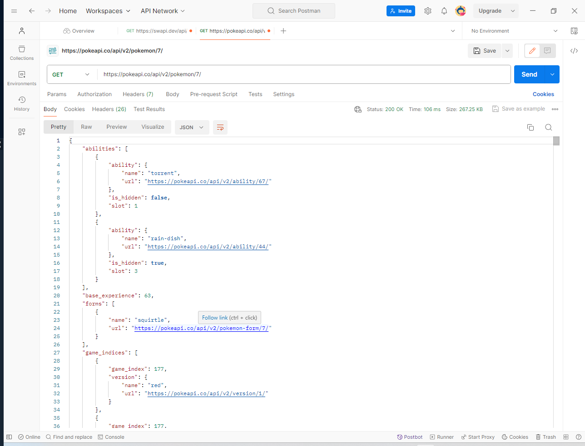

### Objective
Use Postman Api get request on pokemon api.
https://pokeapi.co/api/v2/pokemon/

The first Pokemon i chose was Ivysaur. I used the https://pokeapi.co/api/v2/pokemon/2/ in the url to get ivysaur. The information it produces shows you the abilities in an array,
base experience, forms, game_indices, height, held_items, id,
moves  of the pokemon. It also gives the height, id and the encounter areas.

The next pokemon I searched for was squirtle. url. https://pokeapi.co/api/v2/pokemon/7/ 
original game index of 177 and it was in pokemon red, blue, yellow.

Lastly I chose pidgeotto. has a base experience of 122 and an original game index off 150 in red, blue and yellow.
if i wanted to access the game_indices i would use a data.game_indices[0].game_index or data.game_indices[0].version.name either use should get the desired data from information
