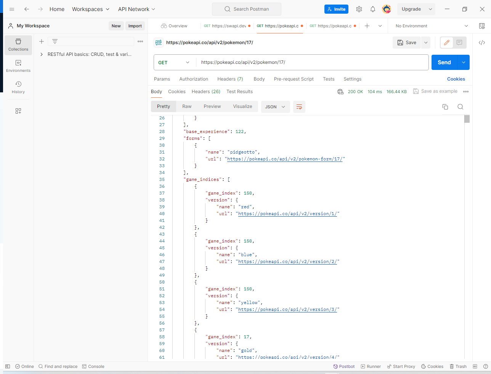

### Objective
Use Postman Api get request on pokemon api.
https://pokeapi.co/api/v2/pokemon/

The first Pokemon i chose was Ivysaur. I used the https://pokeapi.co/api/v2/pokemon/2/ in the url to get ivysaur. The information it produces shows you the abilities in an array,
base experience, forms, game_indices, height, held_items, id,
moves  of the pokemon. It also gives the height, id and the encounter areas.

The next pokemon I searched for was squirtle. url. https://pokeapi.co/api/v2/pokemon/7/ 
original game index of 177 and it was in pokemon red, blue, yellow.

Lastly I chose pidgeotto. has a base experience of 122 and an original game index off 150 in red, blue and yellow.
if i wanted to access the game_indices i would use a data.game_indices[0].game_index or data.game_indices[0].version.name either use should get the desired data from information

 
### Postman Github api
Today I created a github environment in postman to store our bearer token in private.

Then I created a github collection and set the auth to bearer and the value to the variable we stored(pat-github).

Next I set the variables for the Collection I created 2 of them one to store the base url and another to store the rest of what you need to create a repo.

After that we call the first get request of the {baseUrl}user. This gets all my account info and is displayed in json format.
 
Lastly I created a repo using a post request in postman. I took the two variable baseurl and createRepo above and then we have to add a body in raw/json format.

### Day 5
Today I downloaded the Thunder Client Extension to VSCode. The first Thing I did was create an environment with the name Github and set a variable for my bearer token and set it to secret. 

 
I then created an collection with the name GitHub and set the auth to bearer
and the value to my pat-github from before.

 I also set a base url for github which makes the creation of request much easier and looks good.
  Noted you cant set variables in collections like you can on postman but you can make local environments and global ones as well to set any variables you might need. I went ahead and created a create variable thats used for creating new repos.

I then went and created a get request for user info which is my basic info. Only needed to add user to the request since i set the base Url.

After that i created a folder called repos and added a post request with the variable I had set earlier called create.

As you can see i got a status of 201 created and shows all the information on the creation of the new repo.